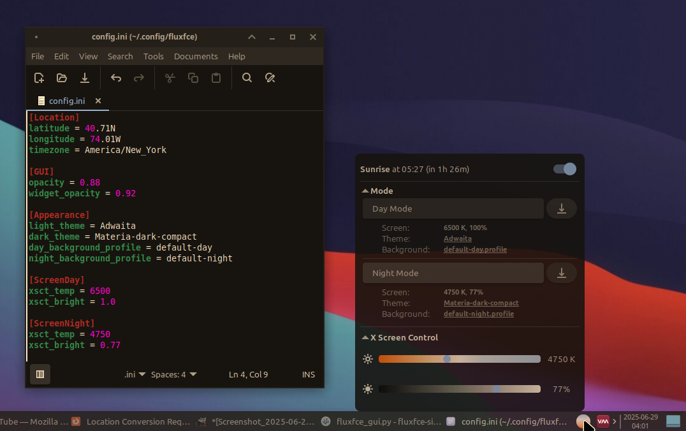

<h2 align="center">
  
</h2>


*fluxfce v0.95 (BETA)*

**fluxfce** automates switching your XFCE desktop appearance — managing GTK theme, desktop background (multi-workspace aware), and screen temperature/brightness — between **Day Mode** and **Night Mode** at local sunrise and sunset. It uses an adapted NOAA algorithm for precise timing and is based on `systemd` user timers, so there's no persistent background daemon.

---

<p align="center">
  
</p>

<p align="center" style="color:orange;">
  <strong>WARNING:</strong> This is beta software. Please use with caution and report any issues.
</p>


## Features

-   **Automatic Sunrise/Sunset Switching:** Transitions your desktop look at the correct local time, every day.
-   **Profile-Based Customization:** Set up your desktop exactly how you like it for day or night, and save that entire look to a profile with a single command.
-   **Comprehensive Appearance Control:**
    -   GTK & Window Manager Theme (`xfconf`)
    -   Desktop Background (any type supported by XFCE, including images, gradients, or solid colors across multiple monitors)
    -   Screen Temperature & Brightness (via `xsct`)
-   **Intuitive User Interface:** A simple, lightweight tray app UI displays status and controls.
-   **Location Aware:** Calculates sun times based on user-configured latitude, longitude, and IANA timezone.
-   **Low Resource Usage:** Uses `systemd` user timers, avoiding a persistent background daemon.
-   **Robust Systemd Integration:** Installs user units for daily rescheduling, precise transitions, and applying the correct theme on login or resume.
-   **Simple Configuration:** Uses a clean INI file for settings and separate, auto-generated profiles for background looks.
-   **Detailed Status Reporting:** `fluxfce status` provides a clear overview of your configuration, sun times, and scheduler state.

## Requirements

-   **Linux Distribution:** An XFCE distribution with `systemd`.
    -   **Tested On:** Mint 21.x+ (XFCE).
    -   *Should work on:* Debian, Fedora XFCE, Arch XFCE, etc. (dependency package names may vary).
-   **Desktop Environment:** XFCE 4.x
-   **Python:** Python 3.9+ (for the `zoneinfo` library).
-   **Dependencies:**
    -   `systemd` (user instance must be running).
    -   `xsct`: For screen temperature/brightness control.
    -   `xfconf-query`: Core XFCE configuration tool.
    -   `xfdesktop`: XFCE desktop manager.
    -   `xrandr`: For multi-monitor awareness.
    -   `python3-gi`, `python3-gi-cairo`, `gir1.2-gtk-3.0`: For the optional GUI.

## Installation

<p style="color:orange;">
  <strong>WARNING:</strong> Running the install command will change your theme to Adwaita (Day) and Adwaita-dark (Night) and change desktop wallpapers to white (Day) / black (Night). This is expected behavior but UX will be improved in a later release.
</p>
  

1.  **Clone the repository:**
    ```bash
    git clone https://github.com/camdoherty/fluxfce-simplified.git
    cd fluxfce-simplified
    ```

2.  **Run the interactive installer:**
    ```bash
    ./fluxfce_cli.py install
    ```
    This command checks dependencies (offering to install them via `apt`), prompts for your location if needed, and installs all necessary `systemd` units.

3.  **Make `fluxfce` available in your PATH (Recommended):**
    For easy access from anywhere in your terminal:
    ```bash
    # Ensure the script is executable
    chmod +x ./fluxfce_cli.py

    # Create a symlink in ~/.local/bin (ensure this is in your PATH)
    mkdir -p ~/.local/bin
    ln -s "$(pwd)/fluxfce_cli.py" ~/.local/bin/fluxfce
    ```

## Getting Started:

After installation:

1.  **Set Your Day Look**  
    Manually configure your desktop for your ideal **Day** appearance: set the GTK theme, wallpaper(s), and screen settings.

2.  **Save the Day Profile**  
    Run this command (or use the "Save" button in the UI):
    ```bash
    fluxfce set-default --mode day
    ```
3.  **Set Your Night Look**  
    Now, reconfigure your desktop for your ideal **Night** appearance.

4.  **Save the Night Profile**  
    Run this command (or use the "Save" button in the UI):
    ```bash
    fluxfce set-default --mode night
    ```

Scheduling should now be active and `fluxfce` will automatically transition between your saved profiles at sunrise and sunset.


## Command Reference

### Setup & Uninstallation
-   `install` — The all-in-one interactive setup command.
-   `uninstall` — Disables scheduling, removes all systemd units, and offers to delete the configuration directory.

### Scheduling Control
-   `enable` / `disable` — Enables or disables automatic scheduling.
-   `status [-v]` — Shows current status. Use `-v` for detailed configuration and systemd unit info.

### Manual Mode Control
-   `day` / `night` — **Temporarily** apply a mode. Auto-scheduling remains active.
-   `force-day` / `force-night` — Apply a mode **and** disable auto-scheduling.
-   `set-default --mode {day|night}` — Saves your current desktop look as the new default for the specified mode.

### Graphical Interface
-   `ui` (or `gui`) — Launches the GUI and system tray icon.

## The GUI

`fluxfce` includes a simple, lightweight 'tray application' GUI and status indicator.

**Launch it by running:**
```bash
fluxfce ui
```
This starts a system tray icon. Clicking it opens a window where you can:
-   View live status and the next transition time.
-   Toggle automatic scheduling with a switch.
-   Instantly apply or re-save your Day and Night profiles.
-   Adjust screen temperature and brightness with live-updating sliders.

## Configuration

-   **Main Config (`~/.config/fluxfce/config.ini`):** Stores your location, theme names, and screen settings. It's managed by the `install` and `set-default` commands but can be edited manually.
-   **Background Profiles (`~/.config/fluxfce/backgrounds/*.profile`):** These files store your complex desktop background settings. The `set-default` command creates and manages them for you.

**Example `config.ini`:**
```ini
[Location]
latitude = 43.65N
longitude = 79.38W
timezone = America/Toronto

[GUI]
opacity = 0.85
widget_opacity = 0.9

[Appearance]
light_theme = Adwaita
dark_theme = Adwaita-dark
day_background_profile = default-day
night_background_profile = default-night

[ScreenDay]
xsct_temp = 6500
xsct_bright = 1.0

[ScreenNight]
xsct_temp = 4500
xsct_bright = 0.85
```
***Tip:*** *To reset screen temperature or brightness for a mode, leave its `xsct_temp` or `xsct_bright` value empty in the config file. `xsct` will revert to its default state during that transition.*

## Troubleshooting

-   **Verbose Logging:** Run any command with the `-v` flag for detailed output: `fluxfce -v status`.

-   **Re-run Dependency Checker:**
    ```bash
    ./fluxfce_deps_check.py
    ```

-   **Systemd Timers and Services:**
    -   **List all `fluxfce` timers** to see when they will next run:
        ```bash
        systemctl --user list-timers --all | grep fluxfce
        ```
    -   **Check the status of a specific unit:**
        ```bash
        systemctl --user status fluxfce-scheduler.service
        ```
    -   **View logs for a specific unit** (most useful for errors):
        ```bash
        journalctl --user -u fluxfce-apply-transition@night.service -e --no-pager
        ```
    -   **Common units to check:**
        -   `fluxfce-scheduler.timer` / `.service` (the daily rescheduler)
        -   `fluxfce-sunrise-event.timer` / `fluxfce-sunset-event.timer` (the dynamic timers)
        -   `fluxfce-apply-transition@day.service` / `@night.service` (the services that do the work)
        -   `fluxfce-login.service` (runs on login)
        -   `fluxfce-resume.service` (runs on resume from suspend)

## License

MIT
